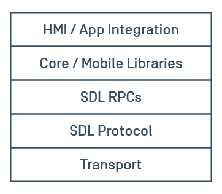
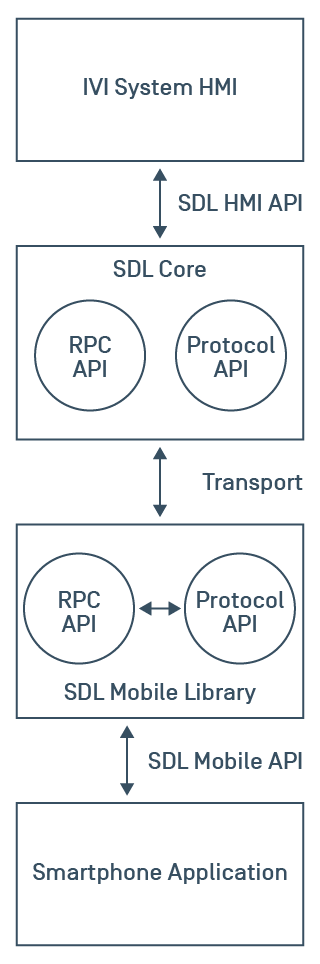

# What is SmartDeviceLink?

## Introduction

SmartDeviceLink (SDL) is a system for application developers to present their apps on an In-Vehicle Infotainment (IVI) system. It works by providing a custom protocol and RPC layer on top of an existing transport, and then provides Android, iOS, and embedded C++ libraries to abstract those layers. Most apps work by telling the system what data they want to display, and the head unit understands how to display the data in a manner that fits with the rest of its IVI user interface (UI). This system allows developers to design their SDL app one time while allowing OEMs the freedom to fit the app within their existing UI.

##### Abstraction Layer Diagram

##### Data Flowchart

## Low-Level APIs

### Transports

SmartDeviceLink is transport agnostic. This means that the transport does not depend on any particular form of data channel, however, in practice, hardware restrictions limit the type of transports that can be used.

On Android, Bluetooth and USB may be the primary transports, while on iOS, we must use iAP and communicate only with MFi certified hardware. iAP also only supports Bluetooth and USB. We strongly recommend iAP 2 and supporting multi-session. See [Mobile Applications/iOS](Mobile Applications/iOS) and [Mobile Applications/Core/Communication with iOS](Mobile Applications/Core/Communication with iOS) for more detail on how iOS and Core communicate over iAP.

A future release of Core will also support Wi-Fi as a production transport (it is currently supported for debugging only).

### Protocol API

The [protocol API and spec](https://www.github.com/smartdevicelink/protocol_spec) are the layers of communication sitting directly on top of the transport. This layer is handled by the Core library.

#### Encryption

In some cases, it may be desirable for a service to carry encrypted data. SDL can support encryption using TLS / DTLS, however, the OEM must provide their own mobile encryption libraries conforming to the type understood by SDL.

### RPC API

The [RPC API and spec](https://www.github.com/smartdevicelink/rpc_spec) is an API based on [JSON RPC](https://en.wikipedia.org/wiki/JSON-RPC). This layer sits directly on top of the protocol layer and runs on the RPC service of the protocol.

## SDL Concepts

### Displaying Information

SDL has APIs for displaying information in a predictable yet flexible way.

For a discussion of templated and projection applications, see [HMI](HMI). This section will focus on templated applications.

Additional [best practices](https://smartdevicelink.com/en/guides/best-practice-guide/display-information/) guides for both [iOS](https://smartdevicelink.com/en/guides/iOS/displaying-information/designing-the-user-interface/) and [Android](https://smartdevicelink.com/en/guides/android/displaying-information/designing-the-user-interface/) are available.

#### Language Support

SDL has APIs that allow developers to alter their application data based on the head unit's language. Once the app is connected to the head unit, the application can retrieve the head unit's current language. If the app supports the head unit language, the app can then alter its registration to update the app's name and other strings.

#### Selecting a Template

SDL templates define what text, buttons, and images can be displayed, though there is some flexibility among implementations of a template on different IVI systems. Each template is designed to show information in a certain configuration. For example, the graphic-with-text template shows a large graphic with multiple text fields, while the tiles-only template only shows multiple soft buttons. The app is assigned a default template on cofiguration. If the IVI system supports multiple templates, apps can switch between the different templates during a session. A list of templates is available when the app connects to the head unit.

#### Screen Text & Images

Applications may update screen text and images in a generic way. The current template will display the information in specific ways. Most templates can display some amount of text, exposed in the API as text field lines to which strings may be set, and images, exposed as a primary and secondary image. Additional images may be uploaded and referenced in areas such as menu items and soft buttons.

#### Menus

The menu system is available on all templates, generally via a menu button provided by the IVI system. Once selected, any menu items defined by the app will appear in a list and may be selected. Only two levels of menus are currently possible. Due to driver distraction rules, the second level of the menu is disabled when the car is moving.

##### Choice Sets

A choice set is a list of options that can be presented using text, voice, or both. If the choice set is presented using text, a list of options will appear on the screen that the user can scroll and select. If presented using voice, the voice-recognition system will prompt the user to make a selection from the choice set using their voice. The user may also be able to text or voice search.

#### Alerts

Alerts are modal screens which may have text and buttons which alert the user of some information or ask the user for some selection. Some apps may be granted permission to present alerts from the background. An example of an alert may be a weather app presenting that rain is about to begin.

#### Buttons

Two kinds of buttons are supported by SDL, soft buttons and hard buttons. Soft buttons are dynamic, on-screen buttons which may be defined and shown to the user by the app. Hard buttons are static on-screen or hard-key buttons which are defined by SDL and the OEM and subscribed to by the app.

##### Soft Buttons

Soft buttons can be placed by the developer on many templates allowing the developer to place custom buttons with text and images to perform custom actions, whether internal to the application, such as activating a shuffle mode, or an SDL UI action, such as activating the car's microphone. 

##### Hard Buttons

Hard buttons can be subscribed to by apps to receive their triggered events. For example, developers can ask to be notified when the play, seek, or tune up and down buttons are pressed. Apps can then perform a custom action they define.

#### Hashes & Resumption

Apps can opt-in to being resumed by the head unit. When changes are made, such as a new choice set is uploaded, Core will pass back a hash to the app. If the app passes this hash back to Core upon connection and it is accepted, all previously uploaded data will be available to the app, such as its menu and choice sets, without the app having to re-send the data.

### Voice Control

In order to assist drivers in interacting with an SDL-enabled application, SDL has robust voice APIs to allow the driver to interact with the app using voice interactions. SDL does not provide voice-recognition services; these must be provided by the IVI system and exposed to SDL over the HMI_API.

#### Voice Strings

The developer can send strings designed to be globally recognized or attached to various SDL elements which are designed to be recognized when spoken by the user. For example, a choice item can have a voice string attached, allowing the user to speak the choice and have that choice selected.

#### Language Support

The head unit's current language often has an effect on how words spoken by the user are recognized; therefore, it is important for applications to support various languages when designing their voice strings or they won't be recognized even if spoken correctly.

#### Microphone Access

In addition to allowing the SDL system to recognize strings passed by the developer, SDL provides an API for raw microphone access. This can be used by, for example, voice assistant applications or any other application that has its own on-device or cloud based voice recognition system.

### Driver Distraction

Preventing driver distraction and providing a safe user interface is very important to SDL. Templates are a solution to the problem of forcing developers to create safe UIs that are certified for every OEM. Because OEMs design their UI in the context of common templates, apps don't have to worry about that.

Additional restrictions may be enforced upon apps when the IVI system believes the driver is distracted. For example, the system may request a lock screen to be placed over the app's UI, or it may disable keyboard input.

### HMI Levels

SDL has four HMI levels: `NONE`, `BACKGROUND`, `LIMITED`, AND `FULL`.

#### NONE

The `NONE` state is the natural state of an application after connection. It provides the app very few permissions; an app in `NONE` is usually highly restricted on the number of RPCs or uploads it may send, and it usually may not perform any sort of UI operations.

#### BACKGROUND

The `BACKGROUND` state occurs after an app has been started by the user, such as by selecting the app in the IVI UI, and then the user has switched away from it. This state usually allows uploads, RPCs, and some UI operations such as Alerts if provided certain permissions.

#### LIMITED

Certain types of apps are permitted to enter the `LIMITED` state. `MEDIA` apps, for example will enter the `LIMITED` state if the app is the currently active media app and the app would enter the background mode. A `NAVIGATION` app may do the same if it is the current navigation app and would enter the background.

#### FULL

The SDL connected app that has the user's focus on screen is in a `FULL` state. At most, only one SDL connected app will have `FULL` at any one time. At this level of focus, the app has full UI permissions, though may still be restricted in terms of accessing vehicle data or other information-related permissions.

### Vehicle Data

Vehicle data may be exposed by the IVI system from the car. For example, a developer may be able to retrieve headlamp status or fuel level. Each data set's availability will be dependent on the integration of the IVI system as well as permissions granted to that app.

### Remote Control

Remote control is a feature allowing an app to control external (non-SDL) modules of the IVI system, such as vehicle climate controls or AM/FM system. Available modules will be dependent on the integration of the IVI system as well as permissions granted to that app.

## Integrating with IVI systems

IVI systems are the audio / visual information and entertainment systems within vehicles. SDL integrates with these systems to allow the user's smartphone applications to display information and provide content.

### Core

Core is the component of SDL integrated by OEMs as middleware into their IVI system and HMI and handles the protocol and RPC layers automatically. Core communicates with the mobile application over the transport layer and with the HMI over another RPC API called the `HMI_API`.

#### Communication with iOS

In order to communicate with iOS, Core must have a channel of communication. Apple regulates this channel through their MFi licensing program and iAP protocol. To communicate with an iOS app, both must know the same protocol string. Every iOS app should already use both the channel switching and multi-session schemes.

##### Channel Switching Scheme

The channel switching scheme is the older, less reliable method of connecting an IVI system's Core to iOS applications. It relies on connecting over a control session, receiving data from the control session about what data session to connect to, and then connecting over that channel. It requires workarounds such as timers based on a hash of the app time and retries to ensure each app gets access to that control session and can connect over a separate data session. This scheme becomes less reliable as more apps connect.

##### Multi-Session Scheme

The newer connection scheme, relying upon iAP 2, is a multi-session scheme which utilizes a single protocol string and session to connect multiple apps over that single session.

### HMI

The HMI is a non-SDL component, essentially the part of the IVI system which controls displaying content to the user. The HMI is responsible for communicating with Core over the `HMI_API` and displaying information and content sent from the mobile application to Core.

#### Templated Applications

All but projection applications will be displayed using a template. Many template layouts are standardized and should be provided through the HMI in order to provide developers with options in building their SDL integrations and allowing them to use the same code across SDL-enabled HMI systems.

#### Projection Applications

In addition to templated applications, a few applications need the ability to "project" their own UI to the HMI via video streaming. Virtually all of these are navigation applications which require video streaming to project their map to the HMI system. Additional projection applications may be created, but it is very strongly recommended that this is limited only to OEM-created applications as there are large downsides to video-streaming based applications.

## Mobile Applications

Mobile applications are integrated with SDL through the iOS and Android mobile libraries. Apps make the SDL library a dependency of their own app and use its APIs to update the templated UI with their own information and content. The mobile libraries take care of all connection, protocol, and RPC layers, providing the developer with abstracted APIs with which to build their applications. For additional information on using the iOS library, see the [iOS guides](iOS guides). For additional information on using the Android library, see the [Android guides](Android guides).

## Web Components

A few web components are essential to SmartDeviceLink. An OEM must host or integrate with these web services to enable them to have the content they desire on their system and provide permissions for applications to access various vehicle data and other potentially sensitive features.

### Policies

Policies are JSON documents describing rules and configurations enforced by SDL Core defining how the system can and will behave. For example, a policy could prohibit the use of an application in a specific type of vehicle. In general, policies are configured by an OEM and stored in their Policy Server. Once configured, all policies for a specific vehicle can be requested and downloaded to the head unit where they can be enforced by SDL Core.

### Policy Servers

An SDL Policy Server's main purpose is to curate policy tables composed of rules and permissions defined by an OEM. Each vehicle will download its policy table and use it to govern SDL behaviors. Additionally, Policy Servers can be used to gather usage information and provide additional functionality defined by the OEM. Check out the [SDL Policy Server guides](https://smartdevicelink.com/en/docs/sdl-server/master/policy-table/overview/) for more detail.

### SHAID Server

SHAID is the Shared Application Information Database server. This is a centralized service run by the SmartDeviceLink Consortium (SDLC) which is designed to keep information about applications integrating SDL synchronized across the SDL ecosystem. SHAID is integrated with the OEM Policy Server to receive real-time updates when SDL application developers integrate a new app or update an existing app. This ensures that OEMs keep their policy tables up to date with the latest information. App developers update their applications via the [SDL Developer Portal](https://www.smartdevicelink.com). Check out the [SHAID API](https://shaid.smartdevicelink.com/docs/) for more details.

## Definitions

* SmartDeviceLink
    * The entire API system which allows a smartphone application to present its data on the head unit system.
* IVI (In-Vehicle Infotainment) system, Head Unit, In-Car Entertainment (ICE) system
    * "In-car entertainment (ICE), or in-vehicle infotainment (IVI), is a collection of hardware and software in automobiles that provides audio or video entertainment. In car entertainment originated with car audio systems that consisted of radios and cassette or CD players, and now includes automotive navigation systems, video players, USB and Bluetooth connectivity, Carputers, in-car internet, and WiFi. Once controlled by simple dashboards knobs and dials, ICE systems can include steering wheel audio controls and handsfree voice control." [via Wikipedia](https://en.wikipedia.org/wiki/In-car_entertainment)
* OEM
    * Original Equipment Manufacturer - In this context, a company which puts cars on the road, such as Ford, Toyota, or Suzuki.
* iAP
    * iPod Accessory Protocol; the protocol sitting on top of the raw data transport layer for MFi devices.
* MFi
    * Made For iPhone; the licensing program for non-Apple made hardware to communicate with Apple hardware – such as iPhones, iPods, iPads, etc.
* Developer
    * The smartphone application developer.
* App
    * A smartphone application connected to an IVI system via SDL.
* User
    * The driver of the car and owner of the smartphone connected via SDL.
* HMI (Human Machine Interface)
    * Generally, the visual user interface displaying information and receiving input from the user.
    * In SDL, the component of the head unit integrating with Core and displaying information coming from the SDL mobile application to the user.
* Template
    * In SDL, a layout on which information may be displayed. SDL standardizes templates as being capable of containing certain information and having a certain general layout, however, the details of the layout may be decided upon by the OEM, allowing their SDL HMI to fit with the rest of their IVI interface.
* SDLC
    * The SmartDeviceLink Consortium, a non-profit organization owned and funded by a collective of OEMs, Suppliers, App Developers, and other parties interested in integrating with SDL.
* Services
    * An SDL service is a protocol-level concept. Data packets are given a service type which defines the "type" of packet, such as RPC, bulk, or video data.